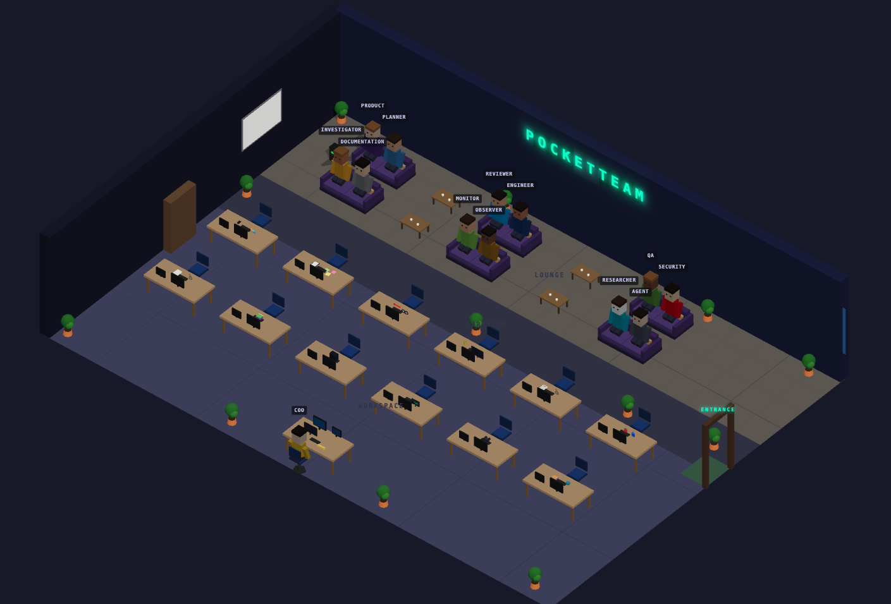
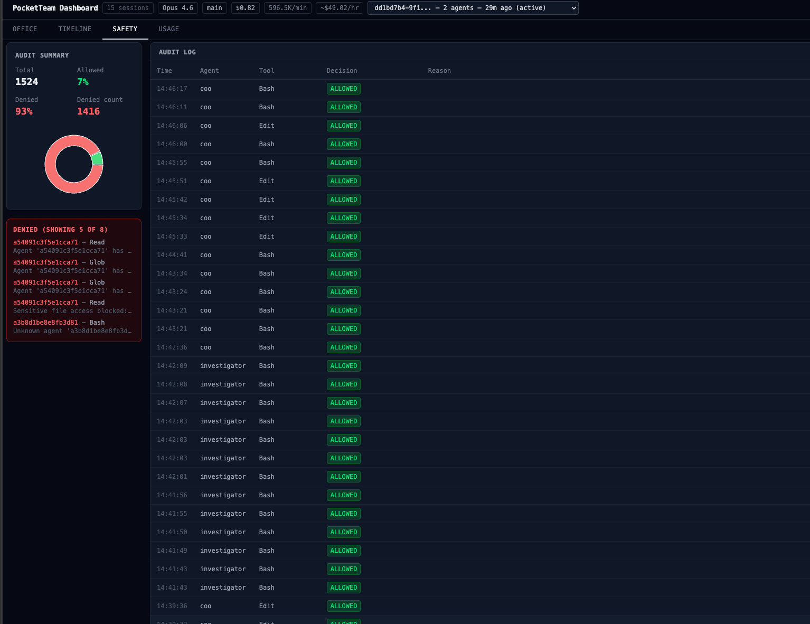

# PocketTeam

<p align="center">
  
  
  
  
  
</p>

<p align="center">
  <strong>Your autonomous AI IT team. Plans, codes, reviews, tests, deploys, and self-heals — all inside Claude Code.</strong>
</p>

<p align="center">
  <a href="#quick-start">Quick Start</a> •
  <a href="#how-it-works">How It Works</a> •
  <a href="#agents">Agents</a> •
  <a href="#health-monitoring-247-via-github-actions">Self-Healing</a> •
  <a href="#safety-deep-dive">Safety</a> •
  <a href="#commands">Commands</a>
</p>

---

> **Auto-Insights** — Daily self-improvement reports. PocketTeam analyzes its own performance,
> identifies friction points, and proposes concrete fixes. Delivered to your Telegram.
> Nothing is applied without your approval.

### What You Get

| | Feature | Description |
|---|---|---|
| **12 Agents** | COO, Product, Planner, Reviewer, Engineer, QA, Security, DevOps, Investigator, Documentation, Monitor, Observer |
| **60 Skills** | From market research to OWASP audits, browser automation to deployment rollbacks |
| **Auto-Insights** | Daily self-analysis with improvement proposals via Telegram | CEO approval required |
| **Health Monitoring** | GitHub Actions monitors your app 24/7. On failure: sends Telegram alert and (on macOS) auto-starts a Claude session to diagnose and plan a fix |
| **3D Dashboard** | Real-time isometric office — see your agents work, track costs, audit safety |
| **Telegram Control** | Give tasks, approve deploys, receive alerts — all from your phone |
| **9-Layer Safety** | Structural hooks (not prompts). Survives context compaction. Cannot be bypassed |
| **Browser Automation** | `ptbrowse` — uses text accessibility tree instead of screenshots (much smaller token footprint) |
| **5 Workflow Modes** | `autopilot`, `ralph` (persistent), `quick`, `deep-dive` (parallel research), `clarify` (intent clarification) |
| **Session Control** | Press Esc in Claude Code to stop a running session immediately |
| **Zero Config** | `pocketteam init` guides you through everything. 7 steps, done |
| **Platform Notes** | Telegram-driven auto-session starting is macOS-only (launchd daemon). GitHub Actions health monitoring works on all platforms. Linux users can still receive Telegram alerts and start sessions manually |

<p align="center">
  
  <br />
  <sub>Real-time 3D isometric office — watch your AI team work</sub>
</p>

---

## The Problem (Why We Built This)

AI coding agents are powerful but risky. Here's what went wrong with previous systems:

- **OpenClaw** deleted 200+ emails because safety constraints lived in conversation context—lost during compaction
- **Single-agent systems** lose context, skip reviews, forget tests, and make catastrophic production mistakes
- **Autonomous agents** have executed `DROP DATABASE`, force-pushed to production, and leaked secrets
- **Weak safety** lives in prompts, which can be manipulated or forgotten

You need a **team with enterprise-grade safety**, not a solo agent and a prayer.

## The Solution

PocketTeam gives you a full autonomous IT team where:

1. **Specialization wins**: 12 specialized agents, each with a clear role and permission model
2. **Safety is structural**: 9 runtime hooks that survive context compaction and cannot be bypassed
3. **You stay in control**: 3 human gates, budget limits, audit trail
4. **Real-time visibility**: 3D isometric office dashboard showing which agents are working, what they're doing, and costs in real-time
5. **Cost-optimized**: Runs on Claude Code subscription ($20–$200/month flat) with Haiku for cheap tasks and Opus on-demand

---

## Features

### 12 Specialized Agents

| Agent | Role | Model | Key Responsibility |
|---|---|---|---|
| **COO** | Orchestrator | inherit | Delegates ALL work to agents — never writes code itself. Enforces pipeline + workflow modes |
| **Product** | Demand validator | Sonnet | Market research, competitive analysis, product briefs (asks 6 forcing questions) |
| **Planner** | Implementation lead | Sonnet | Task breakdown, risk assessment, breaking-change plans |
| **Reviewer** | Code & design auditor | Sonnet | Architecture review, performance analysis, code style enforcement |
| **Engineer** | Implementation | Sonnet | Scaffolding, implementation, debugging, hotfixes |
| **QA** | Testing & verification | Sonnet | Smoke tests, visual QA, test-data setup, E2E testing |
| **Security** | OWASP & threat auditor | Sonnet | OWASP audits, CVE scanning, threat modeling, secrets detection |
| **DevOps** | Deployment orchestrator | Sonnet | Staging deploys, canary releases, rollbacks, CI/CD |
| **Investigator** | Root-cause analyst | Sonnet | Timeline reconstruction, DB diagnostics, incident handoffs |
| **Documentation** | Docs synchronizer | Haiku | README updates, architecture docs, stale-doc audit |
| **Monitor** | 24/7 health watcher | Haiku | Health checks every 5 min, log analysis, auto-escalation |
| **Observer** | Team learner | Haiku | Retrospectives, weekly digests, agent improvement proposals |

### 60 Skills Across the Team

PocketTeam agents have 62 specialized skills distributed across product, planning, engineering, QA, security, DevOps, investigation, monitoring, and documentation domains. Skills include everything from market research and task breakdown to browser automation, OWASP audits, database diagnostics, and threat modeling. The skill system is extensible—add custom skills via `.claude/skills/`.

### Real-Time 3D Isometric Office Dashboard

Watch your AI team work in a pixel-art Habbo-style office:

- **Live agent visualization**: See which agents are active, idle, or thinking
- **Cost tracking**: Token usage, cost per agent, subscription vs API breakdown
- **Rate limits**: Real-time view of API calls remaining, context window usage
- **Event feed**: Live stream of decisions, approvals, and deployments
- **Session picker**: Resume previous work or start fresh
- Built with React Three Fiber + WebSocket real-time updates

Accessed via `pocketteam dashboard start` or embedded in Claude Code.

**4 Dashboard Views:**
- **Office** — 3D isometric office with live agent avatars
- **Timeline** — chronological event stream of all actions
- **Safety** — audit log of every tool call: allowed, denied, reason (NEVER_ALLOW, DENIED_ALLOWLIST, D-SAC)
- **Usage** — token costs per agent, subscription vs API breakdown

<p align="center">
  
  <br />
  <sub>Safety tab — every tool call audited. Red = blocked by safety layers.</sub>
</p>

### ptbrowse: Own Browser Automation CLI

A lightweight, accessibility-tree-based browser automation tool built on Playwright and Bun. It exposes a persistent daemon so every command reuses the same browser instance — no cold-start overhead per step.

`pocketteam init` installs a `ptbrowse` wrapper script in `~/.local/bin`. After adding this to your PATH, it's available in your shell:

```bash
ptbrowse goto https://app.example.com
ptbrowse snapshot -i
ptbrowse fill @e3 user@example.com
ptbrowse click @e5
ptbrowse assert text "Dashboard"
```

#### ptbrowse vs Alternatives

| Capability | ptbrowse | Playwright MCP | gstack /browse |
|---|---|---|---|
| **Token source** | Accessibility tree text | Full screenshot pixels | Full screenshot pixels |
| **Persistent daemon** | Yes (one Chromium, reused) | No (new context per call) | No |
| **Structured refs** | `@e1`…`@eN` (stable across steps) | CSS selectors | Not exposed |
| **Diff snapshots** | Yes (`snapshot -D`) | No | No |
| **Headed mode** | `PTBROWSE_HEADED=1` | Configurable | Configurable |

**Why text over screenshots?** Text accessibility trees are typically 10-20x smaller than image tokens for the same page. This means significantly lower token usage per browser interaction — especially in long automation sequences.

#### Command Reference

**Navigation**

| Command | Description |
|---|---|
| `ptbrowse goto <url>` | Navigate to URL, reset snapshot refs |
| `ptbrowse back` | Go back in history |
| `ptbrowse forward` | Go forward in history |
| `ptbrowse reload` | Reload current page |

**Snapshot**

| Command | Description |
|---|---|
| `ptbrowse snapshot` | Full accessibility tree with `@e` refs |
| `ptbrowse snapshot -i` | Interactive elements only (buttons, links, inputs) |
| `ptbrowse snapshot -c` | Compact one-line format |
| `ptbrowse snapshot -D` | Diff since last snapshot |

**Interaction**

| Command | Description |
|---|---|
| `ptbrowse click <ref>` | Click element (e.g. `@e1`) |
| `ptbrowse fill <ref> <text>` | Fill input field (clears first) |
| `ptbrowse type <ref> <text>` | Type keystroke-by-keystroke |
| `ptbrowse select <ref> <value>` | Select dropdown option |
| `ptbrowse key <key>` | Press keyboard key |
| `ptbrowse hover <ref>` | Hover element |
| `ptbrowse scroll <ref> <dir> <px>` | Scroll N pixels |

**Wait**

| Command | Description |
|---|---|
| `ptbrowse wait text <text>` | Wait until text appears (default 10 s) |
| `ptbrowse wait selector <css>` | Wait until CSS selector exists |
| `ptbrowse wait idle [ms]` | Wait for network idle |
| `ptbrowse wait url <pattern>` | Wait for URL to match regex |

**Assertions** (exit 1 on failure — CI-friendly)

| Command | Description |
|---|---|
| `ptbrowse assert text <text>` | Page contains text |
| `ptbrowse assert no-text <text>` | Page does NOT contain text |
| `ptbrowse assert visible <ref>` | Element is visible |
| `ptbrowse assert enabled <ref>` | Element is enabled |
| `ptbrowse assert url <pattern>` | Current URL matches regex |

**Read**

| Command | Description |
|---|---|
| `ptbrowse text` | Extract full page text (max 8000 chars) |
| `ptbrowse screenshot [path]` | Save PNG |
| `ptbrowse console` | Show browser console messages |
| `ptbrowse eval <expr>` | Evaluate JS expression (requires `PTBROWSE_ALLOW_EVAL=1`) |

**Meta**

| Command | Description |
|---|---|
| `ptbrowse viewport <w> <h>` | Set viewport size |
| `ptbrowse status` | Show daemon status |
| `ptbrowse close` | Close browser and stop daemon |

#### Token Efficiency Benchmark

ptbrowse uses text-based accessibility trees instead of screenshots or full DOM, making it dramatically more token-efficient than conventional browser automation approaches.

**ptbrowse Token Usage** (measured on httpbin.org/forms/post)

| Operation | Tokens |
|---|---|
| Navigate to page | 11 |
| Page snapshot (full) | 285 |
| Interactive elements only | 101 |
| Fill a form field | 6 |
| Click an element | 15 |
| Screenshot (returns file path) | 20 |
| **Complete 8-step task** | **~820** |

Screenshot-based and DOM-based browser automation tools typically consume **up to 90x more tokens** for the same tasks — a single page snapshot can cost 20,000+ tokens when the full accessibility tree or DOM is inlined into the conversation context.

**Why ptbrowse is efficient:**
- **Accessibility trees** — compact text representation (2–5 KB per page)
- **Persistent daemon** — one Chromium instance reused, no browser startup per step
- **Diff snapshots** — only changes returned, not full page re-scan
- **Structured element refs** — stable `@e1`…`@eN` references across steps
- **Screenshots stay on disk** — returns a file path (20 tokens), not base64-encoded image data

**Measured with** ptbrowse v1.0 on httpbin.org/forms/post. Token estimate: 1 token ≈ 4 characters.

#### Headed Mode (For QA)

```bash
PTBROWSE_HEADED=1 ptbrowse goto https://example.com
```

Watch the browser as the agent automates tests. Useful for QA debugging.

### Computer Use: Browser Automation + Desktop Control

PocketTeam can automate browser interactions and (on macOS) control your desktop directly.

**Browser MCP** — Available on all platforms
- Installed automatically during `pocketteam init` (Step 6/7)
- Agents can launch, navigate, interact with web applications
- No additional permissions required
- Works with headless browsers for CI/GitHub Actions

**Native macOS Desktop Control** — macOS only
- Full screen control: mouse, keyboard, screenshots
- Requires Accessibility permissions
- Enable after init: **System Settings → Privacy & Security → Accessibility → Claude Code ✓**
- Then run `/mcp` inside a Claude Code session to activate

Both features are **opt-in** and can be enabled anytime by re-running `pocketteam init` and selecting "yes" at Step 6.

### 9-Layer Safety Guardian

Safety is **structural**, not conversational. Every tool call passes through 9 runtime hooks:

```
Layer  1: NEVER_ALLOW         ──── Kill-switch blocklist (rm -rf /, DROP DATABASE, fork bombs)
Layer  2: DESTRUCTIVE_PATTERNS ──── Requires plan approval (git push --force, DELETE FROM)
Layer  3: MCP TOOL SAFETY     ──── SQL injection prevention, parameterized queries
Layer  4: NETWORK SAFETY      ──── Domain allowlist, exfiltration prevention
Layer  5: SENSITIVE FILES     ──── .env, .ssh, .aws, *.pem protected (never writable)
Layer  6: AGENT ALLOWLIST     ──── Per-agent tool permissions (Planner can't Write)
Layer  7: SCOPE + RATE LIMIT  ──── Budget per agent, file scope from plan
Layer  8: AUDIT LOG          ──── Every decision logged with incident playbooks
Layer  9: D-SAC PATTERN      ──── Dry-run → Staged → Approval → Commit for destructive ops
```

**Why survive context compaction?** OpenClaw's safety rules lived in the conversation and were forgotten during compaction. PocketTeam's safety is implemented as `.claude/settings.json` hooks that are loaded fresh on every Claude Code session. Prompts cannot override them.

### Telegram Integration

Control your AI team from your phone:

```
You: "Add OAuth2 authentication"

PocketTeam: "Plan ready. 3 questions:
   1. OAuth provider (GitHub, Google, Microsoft)?
   2. Scopes needed?
   3. Auto-login or explicit button?"

You: "GitHub, user+email, button"

PocketTeam: "Plan approved. Implementation started..."
   [15 minutes later]

PocketTeam: "✅ Tests: 23/23 passed.
   Code review: approved.
   Security audit: clean.
   Ready for your review."
```

**Telegram Setup:** PocketTeam uses the official Claude Code channel plugin (`--channels plugin:telegram@claude-plugins-official`) for push notifications and mobile task submission.

**Important:** Telegram cannot receive messages during active sessions because Telegram's getUpdates API only allows one consumer. Use the Claude app or Esc in Claude Code to stop a running session.

**Note:** Telegram works only while a PocketTeam session is running (`pocketteam start`). Messages sent when no session is active will be queued and delivered when the next session starts.

### Magic Keywords: Workflow Modes

Activate special workflow modes by starting your task with a keyword:

| Mode | Command | Behavior |
|---|---|---|
| **Autopilot** | `autopilot: Task` | Full pipeline with no human gates (CEO pre-approved by keyword) |
| **Ralph** | `ralph: Task` | Implement → Test loop, keeps going until all tests pass (max 5 iterations) |
| **Quick** | `quick: Task` | Skip planning, implement directly, quick test (for small fixes) |
| **Deep-Dive** | `deep-dive: Topic` | Spawn 3 parallel research agents for thorough analysis |
| **Clarify** | `clarify: Task` | Intent clarification — COO asks questions iteratively (max 10 cycles) before planning |

Example:
```
autopilot: Add dark mode toggle
```

The COO delegates to the full team — Planner plans, Engineer implements, QA tests, Security audits — all without you having to manage anything. You get notified at key milestones via Telegram.

---

## Health Monitoring: 24/7 via GitHub Actions

PocketTeam can monitor your production app around the clock — even when you're asleep. A GitHub Actions workflow checks your health and log endpoints on a schedule. When something breaks, it notifies you via Telegram. On macOS, the Telegram daemon can optionally auto-start a Claude Code session to analyze the problem and create a fix plan. No autonomous changes — you stay in the loop.

### The Flow

```
GitHub Actions (runs every hour)
    │
    ├─ GET /health  → HTTP 200? ✅ All good, done.
    ├─ GET /logs    → Errors found?
    │
    ↓ Problem detected
    │
    ├─ 1. Telegram notification to CEO: "🚨 Problem detected"
    │
    ├─ 2. [macOS only] If Telegram daemon active (no other session running):
    │     └─ Daemon auto-starts: claude --agent pocketteam/coo
    │        COO delegates to Investigator → root cause analysis
    │        COO creates a detailed fix plan
    │
    │     [Linux/other] or [if daemon inactive]:
    │     └─ CEO manually starts session or uses `pocketteam start`
    │
    ├─ 3. Telegram to CEO: "📋 Here's the fix plan. Approve?"
    │
    └─ 4. You approve → COO executes (staging-first, always)
```

### What You Need

- A **health endpoint** on your app (`GET /health` → 200 OK)
- GitHub Actions secrets (set up automatically by `pocketteam init`)
- **macOS (optional)**: Telegram daemon auto-starts sessions on detected failures
- **Linux/other platforms**: Telegram alerts work; manual session start required

### Key Principles

- **CEO-in-the-loop**: Every fix requires your explicit approval via Telegram before going live
- **No autonomous changes**: PocketTeam analyzes and plans, but only executes with your permission
- **Telegram-driven**: Alerts and session start are event-driven via the Telegram daemon (macOS) or manual CLI
- **GitHub-native**: `pocketteam init` creates the repo, sets secrets, pushes the monitoring workflow — zero manual setup

### GitHub Integration

`pocketteam init` Step 5 handles everything automatically via the `gh` CLI:

1. Creates a GitHub repo (or uses an existing one)
2. Sets secrets: `ANTHROPIC_API_KEY`, `TELEGRAM_BOT_TOKEN`, `TELEGRAM_CHAT_ID`
3. Pushes the monitoring workflow (`pocketteam-monitor.yml`)
4. Optionally triggers a first test run

---

## Quick Start

### Prerequisites

- **Python 3.11+** — required
- **[Claude Code CLI](https://docs.anthropic.com/claude-code)** — `npm install -g @anthropic-ai/claude-code`
- **[Bun](https://bun.sh)** — required for ptbrowse and the Dashboard server
- **Docker** — optional, required for `pocketteam dashboard`
- **Anthropic API Key** — optional, needed for the GitHub Actions monitoring workflow (uses Haiku, very low token cost)
- **Telegram Bot Token** — optional, required for mobile control

### Install + Init (2 commands)

```bash
# Recommended — installs globally without polluting your Python environment
pipx install pocketteam
pocketteam init
```

If pipx is not installed yet:
```bash
pip install pipx   # or: brew install pipx
```

If you prefer pip directly:
```bash
pip install pocketteam
```

That's it. The init wizard guides you through 7 steps:

```
Step 1/7: Project Name ................ "my-app"
Step 2/7: API Key ..................... paste or skip (needed for monitoring workflow, uses Haiku — very token-efficient)
Step 3/7: Telegram via Claude Code Channels ... paste bot token (optional)
Step 4/7: Health URL .................. https://myapp.com/health (optional)
Step 5/7: GitHub Integration .......... auto-creates repo, sets secrets, pushes workflow
Step 6/7: Computer Use ................ Browser MCP (all platforms) + native macOS (opt-in)
Step 7/7: Auto-Insights Schedule ...... Daily self-improvement proposals (optional)
```

After init, your project has:
- `.claude/agents/pocketteam/` — 12 agent prompts, ready to delegate
- `.claude/skills/pocketteam/` — 60 skills for every task type
- `.claude/settings.json` — 9-layer safety hooks (structural, not prompts)
- `.pocketteam/config.yaml` — your project configuration
- `.github/workflows/pocketteam-monitor.yml` — 24/7 health monitoring

For development on PocketTeam itself:

```bash
git clone https://github.com/Farid046/PocketTeam.git
cd PocketTeam && pip install -e ".[dev]"
```

### Run Your First Task

Open Claude Code with PocketTeam (automatically loads the COO agent):

```bash
pocketteam start
```

Then give PocketTeam a task:

```
> Build user authentication with OAuth2
```

The COO takes over:
1. **Planner** breaks down the work
2. **Reviewer** validates the plan
3. You approve via Telegram
4. **Engineer** implements on a feature branch
5. **QA** runs all tests
6. **Security** audits for OWASP violations
7. **Documentation** updates your README
8. **DevOps** deploys to staging
9. You approve production via Telegram
10. **Monitor** watches for 15 minutes

Or use autopilot:

```
autopilot: Add dark mode toggle
```

---

## How It Works

### The Pipeline (5 Phases)

```
Phase 1: PLANNING
  ├── Planner reads codebase, writes detailed plan
  ├── Reviewer validates architecture, risks, design
  └── HUMAN GATE: You approve or ask for changes

Phase 2: IMPLEMENTATION
  ├── Engineer implements on feature branch
  ├── Reviewer code-reviews (max 3 rounds)
  ├── QA runs all tests (unit, integration, E2E, browser)
  ├── Security audits (OWASP, CVEs, threat model)
  └── Documentation updates README, API docs, architecture

Phase 3: DEPLOY (requires your infrastructure setup)
  ├── HUMAN GATE: You approve deployment
  ├── DevOps agent assists with deploy commands
  └── Monitor watches health + logs after deploy

Phase 4: 24/7 MONITORING (via GitHub Actions)
  ├── Hourly health checks on your production URL
  ├── Log analysis for error patterns
  ├── On failure: notifies CEO + starts analysis session
  └── CEO approves any fixes before execution
```

### Human Gates

1. **Plan Gate**: You review + approve the plan before any code is written
2. **Deploy Gate**: You approve deployment before anything goes live
3. **Incident Gate**: Problem detected — you approve the fix plan before execution

---

## Safety Deep Dive

### Why 9 Layers?

OpenClaw teaches us that **prompts are not safety**. Their safety constraints lived in conversation context, got lost during compaction, and an agent deleted 200+ emails.

To stop a running session, press Esc in Claude Code — this interrupts the agent immediately.

PocketTeam's safety is:
- **Structural**: Runtime hooks in `.claude/settings.json`, not conversation context
- **Persistent**: Survives context compaction, session restarts, agent handoffs
- **Enforced**: Cannot be "convinced" or "jailbroken"—they are code, not suggestions

### The D-SAC Pattern

D-SAC (Dry-run / Staged / Approval / Commit) uses single-use time-limited tokens to secure approval flows for destructive operations. It prevents agents from silently deleting files, wiping databases, or force-pushing to production.

**The four-step flow:**

```
1. DRY-RUN:  Guardian blocks the operation and produces a preview.
             Shows affected files, rows, scope, and a content hash.

2. STAGED:   System creates a one-time-use approval token
             bound to the exact operation hash and session ID.

3. APPROVAL: CEO reviews the preview and approves or rejects.
             On approval, token is issued with 5-minute TTL.

4. COMMIT:   Agent re-submits operation with token.
             Guardian validates and allows exactly this operation, once.
```

**Security guarantees:**

| Guarantee | How it works |
|---|---|
| **Scope-binding** | Token encodes hash of exact operation. Different scope = rejected. |
| **Session-binding** | Tokens tied to session ID. Cannot be replayed across sessions. |
| **One-time use** | Each token consumed atomically. Second attempt rejected even within TTL. |
| **Re-initiation protection** | Detects wider-scope restarts and warns CEO before proceeding. |
| **Layer 1 override impossible** | `NEVER_ALLOW` operations cannot be unlocked by any token. |

---

## Commands

### Session & Workflow

```bash
pocketteam init              # Setup wizard (7 steps, fully guided)
pocketteam start             # Resume last session with COO agent (--agent pocketteam/coo)
pocketteam start new         # Start a fresh session with COO agent
pocketteam start resume [ID] # Resume session by ID, or open picker
pocketteam sessions          # List and manage pipeline sessions
pocketteam run-headless      # For CI/GitHub Actions (no interactive Claude window)
pocketteam status            # Show project status (config, events)
```

### Monitoring & Logs

```bash
pocketteam logs              # Show event log
pocketteam logs -f           # Follow log (like tail -f)
pocketteam logs --agent qa   # Filter by agent
pocketteam logs --since 1h   # Last hour only
```

### Dashboard

```bash
pocketteam dashboard start          # Start dashboard server
pocketteam dashboard stop           # Stop dashboard
pocketteam dashboard status         # Check if running
pocketteam dashboard logs           # Show dashboard logs
pocketteam dashboard install        # Install dashboard (post-init)
pocketteam dashboard update         # Pull latest image, restart
pocketteam dashboard configure      # Configure port, domain, project root
```

### Analysis & Improvement

```bash
pocketteam retro             # Retrospective on last task
pocketteam health            # System health check
pocketteam uninstall         # Clean removal (keeps artifacts)
```

### Auto-Insights

```bash
pocketteam insights on                       # Enable with default schedule (22:00 UTC)
pocketteam insights on --cron "0 8 * * *"   # Custom cron schedule (8:00 AM UTC)
pocketteam insights status                   # Check current config
pocketteam insights off                      # Disable
pocketteam insights run                      # Show instructions for manual run
```

---

## Project Structure

```
your-project/
├── .claude/
│   ├── CLAUDE.md              ← COO instructions
│   ├── settings.json          ← Safety hooks
│   ├── agents/pocketteam/    ← 12 agent prompts
│   └── skills/               ← Skill definitions
├── .pocketteam/
│   ├── config.yaml            ← Project config
│   ├── artifacts/
│   │   ├── plans/             ← Detailed plans
│   │   ├── reviews/           ← Code reviews
│   │   ├── audit/             ← Audit logs
│   │   └── insights/          ← Auto-Insights daily reports
│   ├── events/
│   │   └── stream.jsonl       ← Activity stream
│   ├── sessions/              ← Session artifacts
│   └── learnings/             ← Agent improvements
├── dashboard/                 ← React dashboard (build artifacts)
└── .github/workflows/
    └── pocketteam-monitor.yml ← 24/7 health monitoring + self-healing
```

---

## Comparison: PocketTeam vs Alternatives

| Feature | PocketTeam | gstack | Oh-My-ClaudeCode | OpenClaw | CrewAI |
|---|---|---|---|---|---|
| **Agents** | 12 | 0 | 32 | 5 | Role-based |
| **Skills** | 62 | 25 | 28 | 0 | Custom |
| **Browser Automation** | ptbrowse (text-based, lower tokens) | /browse | No | No | No |
| **Real-time Dashboard** | 3D isometric office | No | No | No | No |
| **Self-Healing Loop** | Yes (via GitHub Actions + Tunnel) | No | No | No | No |
| **Safety Layers** | 9 (runtime hooks) | 0 | 0 | 8 (context-only) | None |
| **Safety Architecture** | Runtime hooks (survives compaction) | Prompt-based | Prompt-based | Prompt-based (lost on compaction) | None |
| **Kill Switch** | < 1 second out-of-band | No | No | Missing | No |
| **Telegram Integration** | Full control + approvals | No | No | No | No |
| **Terminal HUD** | 2-line statusline | No | No | No | No |
| **Magic Keywords** | autopilot/ralph/quick | No | autopilot | No | No |
| **Session Persistence** | Full transcripts + artifacts | Limited | No | No | No |
| **Audit Trail** | Every action logged | No | No | No | No |
| **Open Source** | MIT | MIT | MIT | MIT (insecure) | MIT |

**OpenClaw footnote:** OpenClaw's 8 safety "layers" were implemented as system-prompt instructions. When Claude's context window compacted during a long session, those instructions were summarized or dropped. An agent proceeded to delete 200+ emails with no safety check triggering. This is a known failure mode of prompt-based safety — it cannot survive context compaction.

**Comparison disclaimer:** Numbers in the table above are approximate and based on publicly available documentation as of March 2026. Feature availability may vary with updates.

### Production Safety: The Critical Difference

Most agent frameworks treat safety as a conversation concern: they inject rules into the system prompt and hope the model follows them. This works until it doesn't.

PocketTeam treats safety as an infrastructure concern. Every tool call — regardless of which agent makes it, regardless of context window state — passes through `.claude/settings.json` runtime hooks before execution. These hooks are loaded fresh by Claude Code on every session start and run as pre/post-tool callbacks outside the model's context. The model cannot read, modify, or reason about them.

---

## Development

### Setup

```bash
git clone https://github.com/Farid046/PocketTeam.git
cd pocketteam

python -m venv .venv
source .venv/bin/activate  # or .venv\Scripts\activate on Windows

pip install -e ".[dev]"
```

### Testing

```bash
pytest                   # Run all tests
pytest --cov=pocketteam # With coverage
ptw                     # Watch mode
```

### Code Quality

```bash
ruff check pocketteam/    # Lint
mypy pocketteam/          # Type checking
ruff format pocketteam/   # Format
```

### Statistics

- **12 agents** with specialized prompts
- **60 skills** distributed across agents
- **~13,000 lines of code** across 78 Python files
- **Tests** across 21 test files
- **9 safety layers** blocking 32+ security patterns
- **2 primary integrations** (Telegram, GitHub Actions)

---

## Troubleshooting

### Telegram not receiving messages

**Symptom:** PocketTeam runs but you get no Telegram notifications.

**Solution:**
```bash
claude plugin install telegram@claude-plugins-official
```

Verify the plugin is installed and your `TELEGRAM_BOT_TOKEN` and `TELEGRAM_CHAT_ID` are correct in `.pocketteam/config.yaml`.

### `ptbrowse` command not found

**Symptom:** `ptbrowse` command fails after `pocketteam init`.

**Solution:**
1. Check that `~/.local/bin` is in your `$PATH`:
   ```bash
   echo $PATH | grep -q ~/.local/bin && echo "OK" || echo "NOT IN PATH"
   ```
2. If missing, add it to your shell profile (`.bashrc`, `.zshrc`, etc.):
   ```bash
   export PATH="$HOME/.local/bin:$PATH"
   ```
3. Reload your shell and run `pocketteam init` again.

### Session keeps creating new windows

**Symptom:** Running `pocketteam start` opens a new Claude Code window each time.

**Solution:**

By default, `pocketteam start` launches Claude Code with the COO agent (`--agent pocketteam/coo`) and continues the last session (equivalent to `--continue`). If you want a fresh session, use:
```bash
pocketteam start new
```

### Telegram messages arrive late or get lost

**Symptom:** Messages sent via Telegram take several seconds to appear, or occasionally don't arrive at all while PocketTeam is busy processing.

**Cause:** This is a limitation of Claude Code's official Telegram channel plugin, not PocketTeam. The plugin delivers messages between tool calls — if Claude is mid-reasoning (thinking, not calling tools), messages queue up and are delivered at the next idle moment. In rare cases during heavy processing, messages can be dropped entirely.

**How to deal with it:**
- **Wait a moment** and resend if your message wasn't acknowledged within ~30 seconds
- **Press Esc** in Claude Code to interrupt the current session immediately
- **Don't send rapid-fire messages** while PocketTeam is working — batch your thoughts into one message
- This is **not a PocketTeam bug** — it's inherent to how Claude Code's channel system delivers external messages during active sessions

### Agent shows as 'unknown' in dashboard

**Symptom:** Dashboard displays agents but some show no name or ID.

**Solution:**

Restart your session. Agent names are populated when subagents first appear in the event stream. New agents registered mid-session may not yet be in the dashboard cache.

---

## Auto-Insights: Continuous Self-Improvement

PocketTeam can analyze its own performance daily and propose concrete improvements — without ever applying changes on its own.

### How It Works

1. **Scheduled Analysis** — A Remote Agent runs on your configured cron schedule (default: daily 22:00 UTC)
2. **Data Gathering** — Reads Claude Code Insights facets, event stream, Observer learnings, and cost data
3. **Improvement Proposals** — Writes a structured report with specific, actionable changes to `.pocketteam/artifacts/insights/YYYY-MM-DD.md`
4. **CEO Notification** — Sends a Telegram summary with key metrics and asks for approval
5. **Human Gate** — Nothing is applied until you say "yes". Each proposal goes through the full pipeline (Plan → Review → Implement → Test)

### Setup

Auto-Insights is configured during `pocketteam init` (Step 7). You can also enable it later:

```bash
pocketteam insights on                    # Enable with default schedule (22:00 UTC)
pocketteam insights on --cron "0 8 * * *" # Custom schedule
pocketteam insights status                # Check current config
pocketteam insights off                   # Disable
```

### Deactivation

When you're done with a project, disable the schedule:

```bash
pocketteam insights off
```

Then remove the Remote Agent trigger at [claude.ai/code/scheduled](https://claude.ai/code/scheduled).

### What It Never Does

- Never applies changes without CEO approval
- Never modifies agent prompts directly
- Never accesses data outside the project scope
- `auto_apply` is hard-coded to `False` and cannot be overridden

---

## Self-Improvement: PocketTeam Builds Itself

PocketTeam was designed to improve itself. Run `pocketteam init` in its own repo and watch:

1. **Planner** creates a plan to improve test coverage
2. **Engineer** implements the changes
3. **QA** verifies nothing broke
4. **Security** audits for new vulnerabilities
5. **Observer** learns from the process and improves agent prompts
6. Next task, the agents are better

Auto-Insights automates this loop — every day, without you having to ask.

---

## License

MIT License. See [LICENSE](LICENSE) for details.

---

<p align="center">
  <strong>Built by a CEO who got tired of being the bottleneck.</strong>
  <br />
  <sub>Give your AI team the safety rails, specialization, and real-time visibility it deserves.</sub>
</p>

<p align="center">
  <a href="https://github.com/Farid046/PocketTeam">Star on GitHub</a>
</p>
