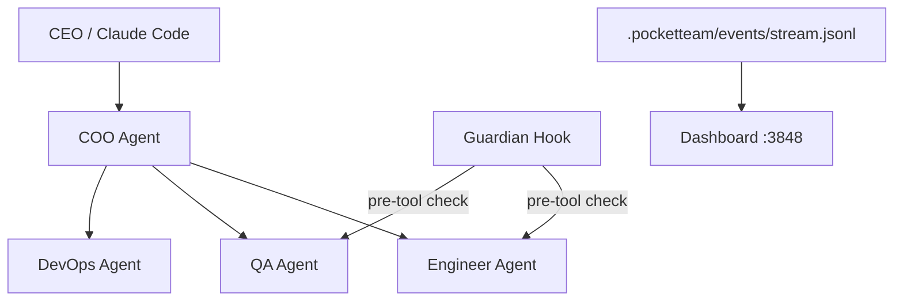

# /architecture-docs — Architecture Documentation

Document system architecture decisions and component relationships. Audience: future engineers on this project.

## When to Use

- A new major component is added (new agent, new service, new data store)
- A significant design decision is made that future engineers need to understand
- The existing architecture diagram no longer matches reality

## ADR (Architecture Decision Record) Template

Save to `.pocketteam/docs/adr/ADR-NNN-[title].md`:

```markdown
# ADR-NNN: [Title]

**Date:** YYYY-MM-DD
**Status:** Accepted / Superseded by ADR-NNN

## Context
[What situation led to needing this decision?]

## Decision
[What was decided?]

## Consequences
**Positive:**
- [what this enables]

**Negative / Trade-offs:**
- [what this costs or constraints]

## Alternatives Considered
- [alternative]: rejected because [reason]
```

## ARCHITECTURE.md Sections

```markdown
## Components
[One paragraph per major component]

## Data Flow
[Mermaid diagram]

## Deployment
[How it runs in production]

## Key Design Decisions
[Link to ADRs]
```

## Mermaid Diagram Template



## Process

1. Read existing ARCHITECTURE.md (or create if missing)
2. Identify what needs adding/updating
3. Write ADR if this was a significant decision
4. Update component diagrams if topology changed
5. Commit: `docs: [what was documented]`
